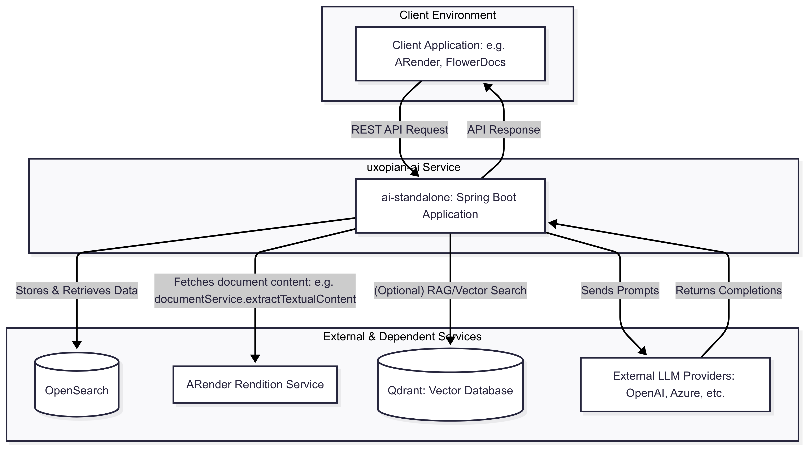
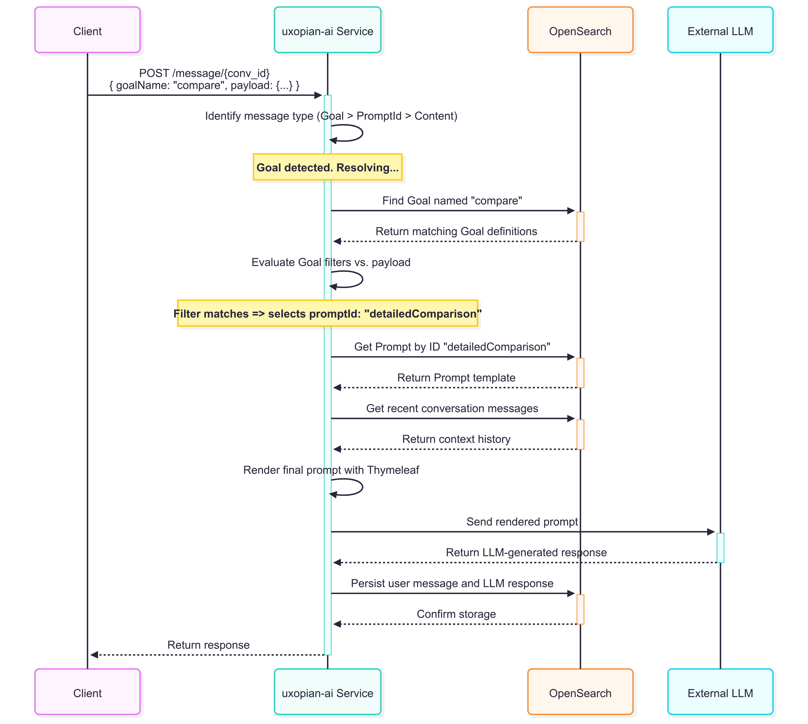

## Architecture

This section provides insight into the framework's design, covering both the high-level components and the software-level interactions.

### Component Architecture

The `uxopian-ai` framework is composed of several key components that work together to deliver its functionality.

* **Client Application**: The user-facing application (like ARender or FlowerDocs) that initiates requests to the `uxopian-ai` service via its REST API.
* **uxopian-ai Service**: The core of the framework. This standalone Java application is responsible for:

  * Exposing the REST API for all interactions.
  * Managing conversations and messages.
  * Resolving Goals and Prompts using the templating engine.
  * Connecting to various external LLM providers via the `llm-clients` module.
  * Persisting conversation history.
* **OpenSearch**: The primary data store for the framework. It is used to save and retrieve all Conversations, Messages, Prompts, and Goals, providing the necessary context for ongoing interactions.
* **ARender Rendition Service**: An external service used by the templating engine to fetch data, such as extracting the full text of a document using its ID (`documentService.extractTextualContent(documentId)`).
* **Qdrant**: An optional vector database used for advanced Retrieval-Augmented Generation (RAG) use cases.
* **External LLM Providers**: Third-party services (like OpenAI, Anthropic, Azure OpenAI, etc.) that perform the actual language model processing. The `uxopian-ai` service acts as a unified gateway to these providers.

---

### Software Architecture (Request Flow)

To understand how the components interact, let's trace the lifecycle of a typical API call: sending a message that uses a Goal.

The chat module handles incoming messages with a clear priority system: a `goalName` is processed first, followed by a `promptId`, and finally a simple content message.

#### Sequence Diagram: Executing a Goal

#### Workflow Steps

1. **Request**: The client sends a message to a conversation, specifying a `goalName` and a payload with context variables.
2. **Goal Resolution**: The service queries OpenSearch to find the Goal(s) matching the specified name.
3. **Filter Evaluation**: It evaluates the filter conditions defined in the retrieved Goal(s) against the payload to select the appropriate `promptId`.
4. **Prompt Retrieval**: The service retrieves the corresponding Prompt definition from OpenSearch using its ID.
5. **Context Retrieval**: It queries OpenSearch to fetch the recent message history for the conversation, providing context.
6. **Template Rendering**: The templating engine (Thymeleaf) assembles the final prompt, injecting the message history and the variables from the client's payload. This may involve calling external services like the ARender Rendition Service to fetch data.
7. **LLM Interaction**: The service sends the complete prompt to the configured external LLM provider.
8. **Persistence**: Upon receiving the response, the service saves both the user's request and the LLM's answer as new messages in OpenSearch.
9. **Response**: The final answer from the LLM is sent back to the client.

---

Next, let's dive into the \[Core Concepts](../concept/overview.md) of the framework.
