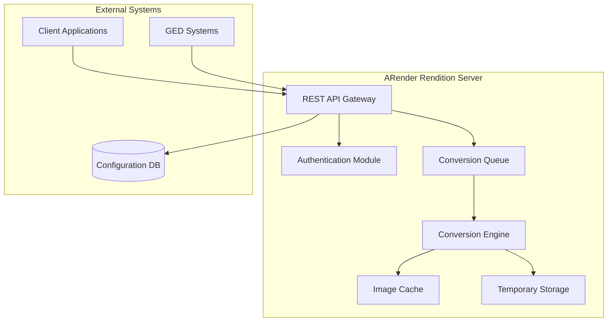

# Vue d'ensemble - Serveur de Rendition

Le serveur de rendition ARender est le cœur du système de visualisation de documents. Il transforme les documents de tous formats en images haute fidélité pour une consultation sécurisée dans le navigateur.

## Rôle du serveur de rendition

### Fonctionnalités principales

#### Conversion de documents
- **250+ formats supportés** : Office, PDF, Images, CAD, Archives
- **Haute fidélité** : Rendu identique au document original
- **Performance optimisée** : Conversion rapide et efficace
- **Gestion mémoire** : Traitement de documents volumineux

#### Sécurité documentaire
- **Isolation complète** : Le document original ne quitte jamais le serveur
- **Rendu en images** : Seules les images de rendu sont transmises
- **Contrôle d'accès** : Authentification et autorisation granulaires
- **Audit complet** : Traçabilité de tous les accès

#### APIs et intégration
- **REST API** : Interface standardisée JSON/HTTP
- **WebSocket** : Communication temps réel
- **Callbacks** : Notifications asynchrones
- **Plugins** : Extensions personnalisées

## Architecture technique

### Composants internes



### Moteurs de conversion

#### LibreOffice Engine
- **Formats** : DOC, DOCX, XLS, XLSX, PPT, PPTX, ODT, ODS, ODP
- **Qualité** : Excellente fidélité de rendu
- **Performance** : Optimisée pour les documents bureautiques
- **Configuration** : Headless mode, pools de processus

#### PDFium Engine  
- **Formats** : PDF (toutes versions)
- **Qualité** : Rendu natif haute résolution
- **Performance** : Très rapide, optimisé Google Chrome
- **Fonctionnalités** : Gestion des formulaires, signatures

#### ImageMagick Engine
- **Formats** : PNG, JPEG, GIF, TIFF, BMP, SVG, etc.
- **Qualité** : Excellent pour les images
- **Performance** : Optimisé pour les formats graphiques
- **Transformations** : Redimensionnement, rotation

#### CAD Engine (Teigha/ODA)
- **Formats** : DWG, DXF, DGN
- **Qualité** : Rendu technique précis
- **Performance** : Optimisé pour les plans techniques
- **Couches** : Gestion des layers et vues

### Formats supportés détaillés

#### Documents bureautiques
```yaml
Microsoft Office:
  - DOC, DOCX (Word 97-2021)
  - XLS, XLSX (Excel 97-2021) 
  - PPT, PPTX (PowerPoint 97-2021)
  - VSD, VSDX (Visio)

LibreOffice/OpenOffice:
  - ODT, ODS, ODP
  - RTF, TXT
  
Autres:
  - PDF (1.0 à 2.0)
  - WordPerfect (WPD)
  - Lotus Notes (NSF)
```

#### Images et médias
```yaml
Images bitmap:
  - JPEG, PNG, GIF
  - TIFF (mono et multipage)
  - BMP, WebP, HEIC

Images vectorielles:
  - SVG, EPS, PS
  - AI (Adobe Illustrator)
  - CDR (CorelDraw)

Vidéo (aperçu):
  - MP4, AVI, MOV
  - WebM, MKV
```

#### Documents techniques
```yaml
CAD/Engineering:
  - DWG, DXF (AutoCAD)
  - DGN (MicroStation) 
  - PLT, HPGL (Plotters)

3D (aperçu):
  - STEP, IGES
  - STL, OBJ
  - 3DS, DAE
```

## Configuration système

### Ressources recommandées

#### Configuration basique (1-10 utilisateurs)
```yaml
CPU: 4 cores @ 2.4 GHz
RAM: 8 GB
Storage: 100 GB SSD
Network: 100 Mbps
JVM Heap: -Xmx4g
```

#### Configuration standard (10-50 utilisateurs) 
```yaml
CPU: 8 cores @ 3.0 GHz  
RAM: 16 GB
Storage: 250 GB SSD
Network: 1 Gbps
JVM Heap: -Xmx8g
```

#### Configuration haute performance (50+ utilisateurs)
```yaml
CPU: 16+ cores @ 3.2 GHz
RAM: 32+ GB  
Storage: 500+ GB NVMe SSD
Network: 10 Gbps
JVM Heap: -Xmx16g
```

### Optimisations système

#### Linux (Recommandé)
```bash
# Configuration mémoire virtuelle
echo 'vm.swappiness=10' >> /etc/sysctl.conf
echo 'vm.vfs_cache_pressure=50' >> /etc/sysctl.conf

# Limites de fichiers ouverts
echo '* soft nofile 65536' >> /etc/security/limits.conf
echo '* hard nofile 65536' >> /etc/security/limits.conf

# Configuration tmpfs pour performances
echo 'tmpfs /tmp tmpfs defaults,size=8G 0 0' >> /etc/fstab
```

#### Java JVM
```bash
# Options JVM recommandées
JAVA_OPTS="-Xms4g -Xmx16g"
JAVA_OPTS="$JAVA_OPTS -XX:+UseG1GC"
JAVA_OPTS="$JAVA_OPTS -XX:MaxGCPauseMillis=200"
JAVA_OPTS="$JAVA_OPTS -XX:+UseStringDeduplication"
JAVA_OPTS="$JAVA_OPTS -Djava.awt.headless=true"
JAVA_OPTS="$JAVA_OPTS -Dfile.encoding=UTF-8"
```

## Sécurité et réseau

### Ports et protocoles
```yaml
Port principal: 8080
Protocoles: HTTP, HTTPS
Health check: GET /api/health
Metrics: GET /api/metrics (optionnel)
```

### Configuration HTTPS
```bash
# Génération de keystore Java
keytool -genkey -alias arender -keyalg RSA -keystore arender.jks -keysize 2048

# Configuration serveur
server.port=8443
server.ssl.key-store=classpath:arender.jks
server.ssl.key-store-password=changeme
server.ssl.key-alias=arender
```

### Authentification
```yaml
Modes supportés:
  - Anonymous (développement)
  - Basic Authentication
  - JWT Token
  - SAML 2.0
  - OpenID Connect
  - Custom (plugin)
```

## Monitoring et observabilité

### Métriques disponibles
- **Performance** : Temps de conversion, throughput
- **Ressources** : CPU, mémoire, disque, réseau  
- **Erreurs** : Échecs de conversion, timeouts
- **Utilisation** : Documents traités, utilisateurs actifs

### Endpoints de monitoring
```bash
# Health check
curl http://localhost:8080/api/health

# Métriques Prometheus
curl http://localhost:8080/api/metrics

# Informations système
curl http://localhost:8080/api/info
```

### Logs
```yaml
Niveaux: ERROR, WARN, INFO, DEBUG, TRACE
Format: JSON ou Logback pattern
Rotation: Taille ou temps
Destination: Fichier, syslog, ELK
```

## Performance et scalabilité

### Optimisations de performance
- **Pool de conversion** : Processus parallèles
- **Cache intelligent** : Images et métadonnées
- **Compression** : Réduction de bande passante
- **CDN** : Distribution géographique

### Scaling horizontal
```yaml
Mode cluster:
  - Load balancer (HAProxy, Nginx)
  - Serveurs multiples
  - Cache partagé (Redis)
  - Base de données commune
```

### Benchmarks typiques
```yaml
Document Office (10 pages):
  Temps: <3 secondes
  Résolution: 150 DPI
  Format sortie: PNG

PDF complexe (100 pages):
  Temps: <15 secondes
  Résolution: 200 DPI
  Format sortie: JPEG

Image haute résolution:
  Temps: <1 seconde
  Redimensionnement: Automatique
  Optimisation: WebP si supporté
```

## Prochaines étapes

1. **[Prérequis](./prerequis.md)** : Vérifiez votre environnement
2. **[Installation](./installation.md)** : Installez le serveur de rendition
3. **[Configuration](./configuration.md)** : Configurez selon vos besoins
4. **[Démarrage](./demarage.md)** : Lancez le service
5. **[Vérification](./verification.md)** : Validez l'installation
6. **[Test](./test.md)** : Testez avec vos documents