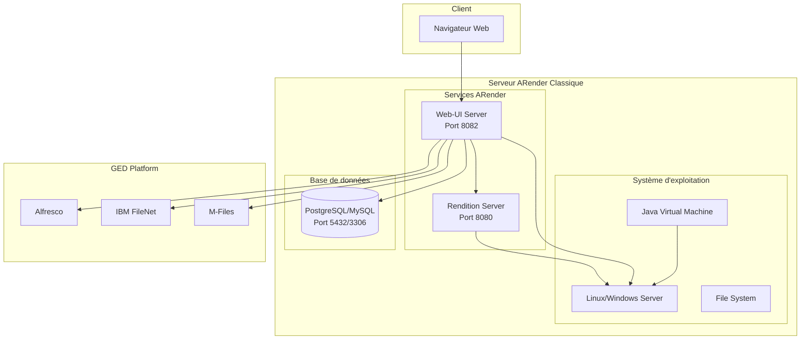

# Vue d'ensemble - Mode classique (Non-Docker)

Le mode d'installation classique d'ARender permet un déploiement traditionnel sur serveurs physiques ou machines virtuelles, offrant un contrôle total sur l'environnement d'exécution.

## Caractéristiques du mode classique

### Avantages
- **Contrôle complet** : Configuration fine de tous les paramètres système
- **Performance optimisée** : Accès direct aux ressources hardware
- **Intégration native** : Interaction directe avec l'OS et les services existants
- **Flexibilité maximale** : Adaptations spécifiques possibles

### Inconvénients
- **Complexité** : Configuration manuelle requise
- **Dépendances** : Gestion des versions et compatibilités
- **Maintenance** : Mise à jour et monitoring manuels
- **Isolation** : Risques de conflits entre services

## Architecture classique



## Composants principaux

### Serveur de Rendition
Le serveur de rendition est responsable de la conversion des documents :

#### Rôle et responsabilités
- **Conversion de formats** : Plus de 250 formats supportés
- **Génération d'images** : Rendu haute fidélité des documents
- **Extraction de métadonnées** : Informations structurées
- **Gestion des annotations** : Overlay d'annotations sur les rendus

#### Spécifications techniques
- **Port par défaut** : 8080
- **Protocole** : HTTP/HTTPS
- **API** : REST JSON
- **Formats d'entrée** : PDF, Office, Images, CAD, etc.
- **Formats de sortie** : PNG, JPEG, SVG, PDF

### Serveur Web-UI
Le serveur Web-UI fournit l'interface utilisateur et les connecteurs :

#### Rôle et responsabilités
- **Interface utilisateur** : Application web moderne
- **Authentification** : Gestion des sessions utilisateur
- **Connecteurs GED** : Intégration avec les plateformes documentaires
- **API REST** : Services pour applications tierces

#### Spécifications techniques
- **Port par défaut** : 8082
- **Protocole** : HTTP/HTTPS
- **Framework** : Spring Boot
- **Base de données** : Configuration et cache
- **Sessions** : Redis ou en mémoire

## Prérequis système détaillés

### Système d'exploitation

#### Linux (Recommandé)
- **Ubuntu** : 20.04 LTS, 22.04 LTS
- **Red Hat Enterprise Linux** : 8.x, 9.x
- **CentOS** : 8.x (EOL), 9.x Stream
- **SUSE Linux Enterprise** : 15.x
- **Debian** : 11.x, 12.x

#### Windows Server
- **Windows Server 2019** : Standard, Datacenter
- **Windows Server 2022** : Standard, Datacenter
- **Windows 10/11** : Développement uniquement

### Ressources matérielles

#### Configuration minimale (environnement de test)
```yaml
CPU: 4 cores (2.4 GHz)
RAM: 8 GB
Storage: 100 GB SSD
Network: 100 Mbps
Concurrent Users: <10
```

#### Configuration recommandée (production)
```yaml
CPU: 8-16 cores (3.0+ GHz)
RAM: 32-64 GB
Storage: 500 GB NVMe SSD
Network: 1 Gbps
Concurrent Users: 50-200
```

#### Configuration haute performance
```yaml
CPU: 24+ cores (3.2+ GHz)
RAM: 128+ GB
Storage: 1+ TB NVMe SSD (RAID 10)
Network: 10 Gbps
Concurrent Users: 500+
```

### Logiciels requis

#### Java Runtime Environment
```bash
# Version supportées
OpenJDK 11, 17, 21
Oracle JDK 11, 17, 21

# Variables d'environnement requises
JAVA_HOME=/path/to/java
PATH=$PATH:$JAVA_HOME/bin
```

#### Base de données supportées
```yaml
PostgreSQL:
  versions: [12, 13, 14, 15, 16]
  recommended: 15
  
MySQL:
  versions: [8.0, 8.1]
  engine: InnoDB
  
Microsoft SQL Server:
  versions: [2017, 2019, 2022]
  edition: Standard, Enterprise
  
Oracle Database:
  versions: [19c, 21c, 23c]
  edition: Standard, Enterprise
```

## Sécurité et réseau

### Ports réseau requis

| Service | Port | Protocole | Description |
|---------|------|-----------|-------------|
| Rendition Server | 8080 | HTTP/HTTPS | API de conversion |
| Web-UI Server | 8082 | HTTP/HTTPS | Interface utilisateur |
| Base de données | 5432/3306 | TCP | PostgreSQL/MySQL |
| Monitoring | 8090 | HTTP | Métriques (optionnel) |

### Configuration firewall
```bash
# Exemple iptables (Linux)
iptables -A INPUT -p tcp --dport 8080 -j ACCEPT
iptables -A INPUT -p tcp --dport 8082 -j ACCEPT
iptables -A INPUT -p tcp --dport 5432 -j ACCEPT

# Exemple Windows Firewall
netsh advfirewall firewall add rule name="ARender Rendition" dir=in action=allow protocol=TCP localport=8080
netsh advfirewall firewall add rule name="ARender WebUI" dir=in action=allow protocol=TCP localport=8082
```

### Certificats SSL/TLS
```bash
# Génération de certificat auto-signé (développement)
openssl req -x509 -newkey rsa:4096 -keyout arender-key.pem -out arender-cert.pem -days 365 -nodes

# Configuration avec certificat CA (production)
# Utilisez des certificats signés par une autorité de certification
```

## Planification du déploiement

### Architecture recommandée

#### Déploiement simple (PME)
```
[Load Balancer] → [ARender Server] → [Database]
                       ↓
               [Shared Storage/NFS]
```

#### Déploiement haute disponibilité (Grande entreprise)
```
[Load Balancer] → [ARender Cluster] → [Database Cluster]
                       ↓
               [Distributed Storage]
```

### Étapes de déploiement
1. **Préparation infrastructure** : Serveurs, réseau, stockage
2. **Installation prérequis** : Java, base de données
3. **Configuration sécurité** : Certificats, firewall
4. **Installation ARender** : Rendition puis Web-UI
5. **Configuration connecteurs** : Intégration GED
6. **Tests et validation** : Fonctionnel et performance
7. **Mise en production** : Déploiement progressif

## Prochaines étapes

Choisissez le composant à installer :

1. **[Serveur de Rendition](./rendition/)** : Commencez par le cœur d'ARender
2. **[Serveur Web-UI](./web-ui/)** : Interface utilisateur et connecteurs

Ou consultez les guides spécifiques à votre environnement GED dans la section Web-UI.