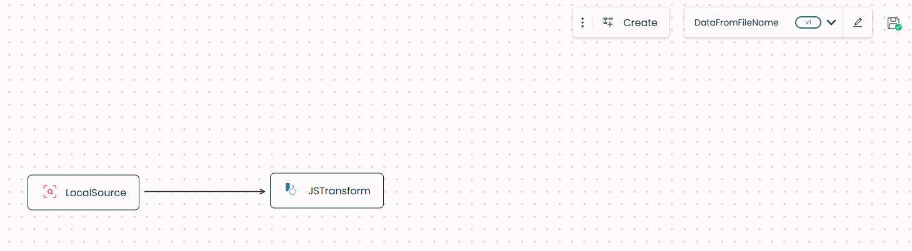

Times will happen when you will not be able to rely on side-file metadata documents to map onto the documents you are migrating. The data will be concatenated into the file name.

Fortunatelly with Fast2, there is still a possibility to parse this file name and pull out the required metadata. Last step would be to tight them down into the document dataset.

## :face_with_raised_eyebrow: Where do we come from ?

For the educational aspect of this topic, let us consider a folder gathering several documents, all with the same format : `<!-- Commentaire nettoyé -->-<data2>`.

Our folder looks like this:


```txt
├─ folder-to-extract
│       ├─ contract-123-ABC.pdf
│       ├─ contract-346-DEF.pdf
│       │             
│       ├─ bill-123-ABC.pdf
│       ├─ bill-346-DEF.pdf
│       │ 
│       ├─ contract-123-ABC.pdf
│       ├─ contract-346-DEF.pdf
│       │             
│       ├─ draft-123-ABC.pdf
│       ├─ draft-346-DEF.pdf
│       └─ ...
└─ ...
```

## Where to go ?

At a glance, we are just 3 (major) steps away from having a PDF content in our punnet, with a basic dataset populated from the JSON metadata :

1. Scan the parent folder and list all the documents with names to map,
1. Get the document path, and isolate the file name
1. Parse the file name and attach the metadata to the [dataset](../getting-started/overall-concepts.md#dataset). For this example, data will be mapped onto the document dataset.


## Way to go !

Inside Fast2, the map design is now pretty straightforward, given our ideas are rather clear in terms of the overall order of the operations.

The map is even quite close to the 3 steps detailed earlier. The [LocalSource](../catalog/source.md#LocalSource) task just needs to be given the path of the folders to deal with. This task will also identify the file name and attach the metadata to the document dataset.

Then the [JSTranform](../catalog/transformer.md#JSTransform) will retrieve the corresponding document path, and carry on with the data mapping.

That way, we end up with 4 tasks :

- [LocalSource](../catalog/source.md#LocalSource), to collect the documents from local storage,
- [JSTranform](../catalog/transformer.md#JSTransform), whose role will be to :
  parse the file name
  add the data to the dataset





### :test_tube: JavaScript elaboration

Although the configuration of the first task can be easily guessed, the [JSTranform](../catalog/transformer.md#JSTransform) final resulting script should look something like this :

```js
punnet.getDocuments().forEach(function (doc) <!-- Commentaire nettoyé -->);
```

1.  Get the filename, and remove the extension
2.  Parse the filename with the separator character
3.  Attach the data


Head out now to the Run screen, start your campaign and just... enjoy !

### :checkered_flag: Result

At the latest stage of your workflow, the document dataset is filled with the properties found in the JSON and integrated as metadata.

```json {17-19}
<!-- Commentaire nettoyé -->,
				"lastModified": {
					"value": "Mon Dec 27 14:10:47 CET 2021",
					"type": "Date"
				},
				"document-type": "document",
				"data1": "123",
				"data2": "ABC"
			},
			"contents": {
				"url": "C:\\samples\\document-123-ABC.pdf"
			},
			"folders": [...]
		}
	]
}
```

## Let's sum up

We can bring this scenario further by mapping data from the parent folder(s). We would just need the document path, which can be retrieved easily, as explained in [the advanced section of how to handle the JS Tranform task](../advanced/javascript.md).

For a OS-proofed script (Linux or Windows have their own subtleties when it comes to paths), you may need to make sure the parsing is done correctly, by standardizing the folder-architecture-related special characters from the Windows `\` to a regular `/`.

If this use-case echoes your early needs, other tasks can be tied to this map to reach a higher level of complexity characteristic of real-world migration projects.
