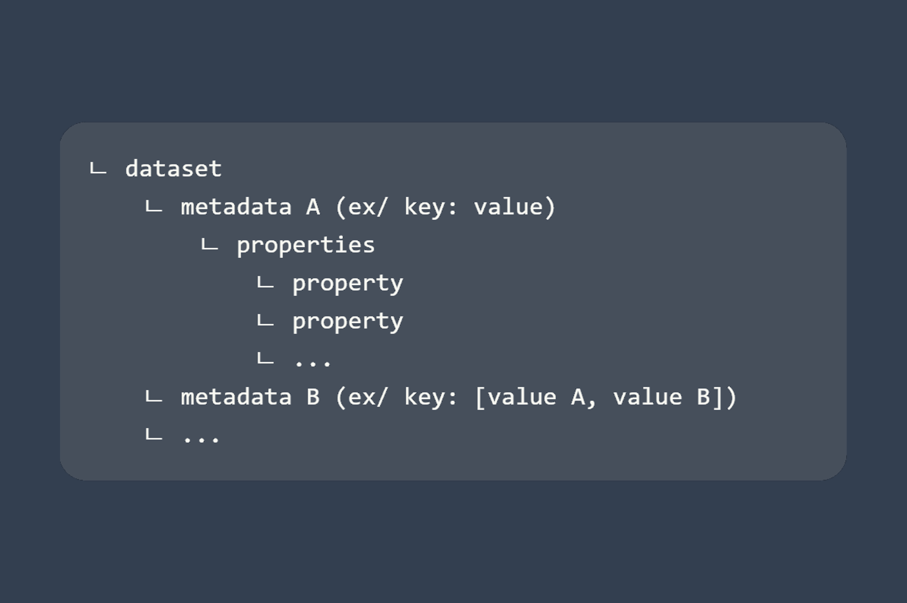

# Learn how to deal with datasets



Datasets are Fast2 objects which can be involved at different levels within the punnet.

They can be found on the

- punnets
- documents
- workflows

Datasets gather data which can be manipulated to store properties, and can be accessed as follows:

```java
DataSet dataset = punnet.getDataSet();

DataSet dataset = document.getDataSet();

DataSet dataset = workflow.getDataSet();
```

Since datasets are just groups of data, understanding basic operations with data is primordial.

## Data object

In Fast2, a data has 3 different informations:

- its name,
- its type (`String` or `int`)
- its value(s)

The following line retrieve the data as object :

```java
Data data = dataset.getData(dataName);
```

### Name

Getting the name of a data just goes like:

```java
String dataName = data.getSymbolicName();
```

### Type

If no type has been defined when the data has been created, the data type will be `null`.

However Fast2 will treat the value of the data as a regular `String`.

```java
String dataType = data.getType();
```

### Value(s)

When dealing with data, some can be single-valued while others can be multi-valued.

The returned object will differ accordingly.

```java
String dataValue = data.getValue();

List<!-- Commentaire nettoyé --> allData = myDataset.getData();

for(Data data : allData){
    // ...
}
```

## Retrieve data value(s)

The following line retrieve the data as object :

```java
Data data = dataset.getData(dataName);
```

### Single-valued data

The dataset offers a shortcut to get the value(s) of any data:

```java
// 1st way : via data object
String value = myDataSet.getData(dataName).getValue();

// or

// 2nd way : dataset shortcut
String value = myDataSet.getDataValue(dataName);
```

### Multi-valued data

```java
// 1st way : via data object
List<!-- Commentaire nettoyé --> value = myDataSet.getDataValues(dataName);
```

## Remove data

If the data has been found and could successfully be removed, the following method will return `TRUE`:

```java
boolean removedSuccessfully = myDataset.removeData(name);
```

## Check if data exists

Rely on this method to make sure not to overwrite any existing data, nor having a `DataNotFoundException` exception.

```java
boolean exists = myDataset.hasData(name);
```

## DataNotFound exception

When operations are performed on non-existing data, an exception of type `DataNotFoundException` is thrown.

---
