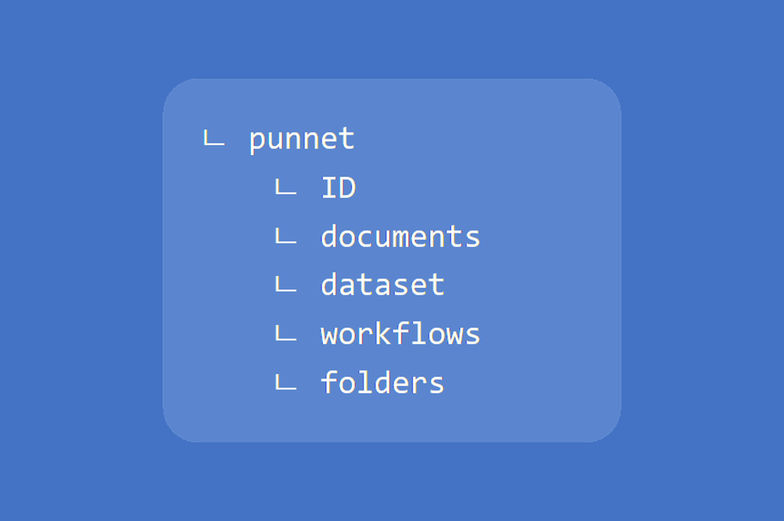

# Learn how to deal with punnets



Since the punnet is the pivot format into Fast2, all documents, folders and metadata can only be manipulated through this object. Here are the basics for an appropriate understanding of the Java API of the punnet object.

For a better understanding of the following, the punnet structure needs to be clearly visualized. If required, go back to [the definition](../getting-started/overall-concepts.md#punnet) of such an object in Fast2.

## Creating a punnet

The creation of a punnet is an operation which should only take place in source tasks, as all other tasks only process punnets given to the as input.

To create a punnet:

```java
Punnet myPunnet = task.getManager().getPunnetFactory().createEmptyPunnet();
```

The punnet ID will be automatically computed by Fast2, following certain models based on the task producing the punnet. This ID can be useful to track the punnet over different tasks, as its value will remain unchanged.

### ID

To force the ID of the punnet, a `String` value can be passed as argument.

```java
myPunnet.setPunnetId(PunnetId.id("myId"));
```

Retrieving the ID of the punnet just goes as so:

```java
PunnetId punnetId = myPunnet.getPunnetId();
```

### Sending a punnet into the campaign

The source tasks are responsible for not only create the punnet, but also send it in the migration workflow.

Once the punnet is created and its components are correctly formed, the last step of the source will rely on the `Consumer` input parameter of the main method of the connector :

```java
consumer.push(myPunnet);
```

## Documents

Punnets may or may not embed document(s).

Several-documents cases could be like:

- the migration strategy is to group in a punnet all documents stored in a given folder
- the migration strategy is to group in a punnet all documents matching a criterion (depending of the configuration fields of the source)
- a punnet embed a released version of a document and all its past versions.

Whatever the reason, the documents can be added to the punnet in two ways:

1. The document was **already existing**:

   ```java
   Document myDoc = myPunnet.addDocument(myDocument);
   ```

2. The document **needs to be created**, which can be done on the fly:

   ```java
   Document myDoc = myPunnet.addDocument(DocumentId.id());
   ```

All documents can be access via the list of all documents stored in the punnet:

```java
List<!-- Commentaire nettoyé -->

## Folders

The punnet folderset can be used for folders-only migration and well as folder-as-a-whole ones, where a punnet will contain a folder reference and all the documents previously filed into this folder.

A folderset can contains one or several folder references, and is access as follows:

```java
FolderSet myFolders = myPunnet.getFolders();
```

A punnet is built with an empty folderset by default.

<!-- Commentaire nettoyé -->
