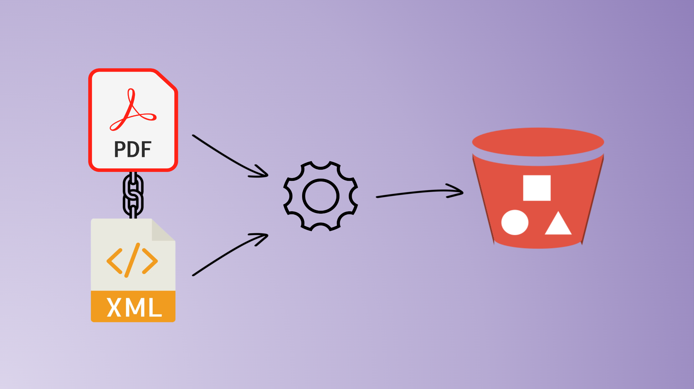
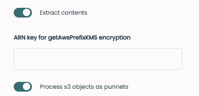

Injecting metadata into an S3 bucket needs to be done differently that what could be done with a regular content management system where a document is a set of contents and metadata. This constraint is even enforced when we upload documents into a SnowBall drive.

Let's quickly review here how storing both content and metadata in a S3 bucket can be achieved with Fast2.

## 🧐 Where do we come from ?
Let's suppose just extracted a document from a well known CMS solution, which created a regular punnet with a set of metadata and one content (ex/ a PDF file).

Injecting this document directly into a S3 bucket would just create a new binary file with the ID of the document as the name of the file in the bucket, and that would be all. Each and every metadata would have been lost in the way.

## 🤔 Where to go ?
To counteract this loss, we need to get Fast2 to add these metadata as a content too.

This can easily be done with the off-the-shelf tasks of Fast2, namely the [PunnetSerializer](../catalog/tool.md#PunnetSerializer) task and the [AlterDocumentContent](../catalog/transformer.md#AlterDocumentContent) task. Respectively, these tasks will create a new binary file with the metadata as XML inside, according to the Fast2 data model which you can find [here](../getting-started/overall-concepts.md#punnet).

In the end, we expect the bucket to have 2 contents for 1 document :

- 1 content in PDF, the original content of our document, whose name is the ID of the document with the correct extension (`.pdf`) 
- 1 content in XML, filled with the metadata of the original document, whose name is the ID of the document with the correct extension (`.xml`)


## 🚀 Way to go !
Let's first create an XML file out of the metadata of the punnet, attach this created file to the document, and inject them later into our bucket.


### ⚗️ From metadata to XML
Once our document fully extracted from the source CMS (via the tasks Source and ContentExtractor), we have the content and the metadata in a punnet.

```xml
The [PunnetSerializer](../catalog/tool.md#PunnetSerializer) will convert the in-memory dataset record into XML format, in the default storage architecture (namely `$FAST2_HOME/files/<!-- Commentaire nettoyé -->/<!-- Commentaire nettoyé -->Process S3 objects as punnets (ie. metadata as XML and associated content)<!-- Commentaire nettoyé -->Extract punnet contents (if required)
```


