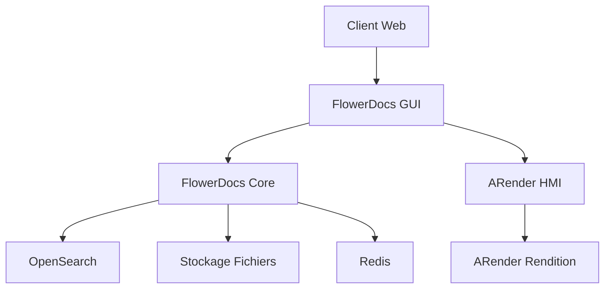

# Concepts FlowerDocs

:::info
Prenez en main les concepts liés au modèle de données FlowerDocs conçu dans le but de faciliter : 

* la compréhension
* la ré-utilisabilité des objets définis
* l'administration de la solution  
:::

Cette section décrit brièvement les concepts nécessaires à la mise en place d'une solution basée sur FlowerDocs.

:::info Dématérialisation
**Vos documents sont encore au _format papier_ ?** 

[Contactez nous](https://www.arondor.com/arondor/) pour en connaître plus sur notre expertise concernant la dématérialisation et mettre en place une chaîne de dématérialisation afin d'alimenter votre solution FlowerDocs.
:::

## Modèle de données

FlowerDocs s'appuie sur un modèle de données flexible permettant de gérer différents types de contenus documentaires :

### Documents
Les documents constituent l'élément central de FlowerDocs. Chaque document possède :
- **Métadonnées** : informations descriptives (titre, auteur, date, etc.)
- **Contenu** : fichier binaire (PDF, Word, image, etc.)
- **Versions** : historique des modifications
- **Liens** : relations avec d'autres documents ou dossiers

### Dossiers
Les dossiers permettent d'organiser logiquement les documents :
- **Statiques** : contenu défini manuellement
- **Dynamiques** : contenu généré automatiquement par des critères de recherche
- **Hiérarchiques** : organisation en arborescence

### Tâches
Le système de tâches permet de gérer les workflows documentaires :
- **Assignation** : attribution à des utilisateurs ou groupes
- **États** : suivi du cycle de vie des tâches
- **Notifications** : alertes et rappels automatiques

## Architecture technique

### Composants principaux

FlowerDocs s'articule autour de plusieurs composants :

1. **FlowerDocs Core** : moteur de GED et API REST/SOAP
2. **FlowerDocs GUI** : interface web utilisateur
3. **ARender** : moteur de visualisation documentaire
4. **OpenSearch** : indexation et recherche
5. **Redis** : cache et files d'attente

### Flux de données

## Sécurité

### Authentification
- **LDAP/Active Directory** : intégration avec l'annuaire d'entreprise
- **SSO** : Single Sign-On avec les solutions d'entreprise
- **Tokens** : gestion des jetons d'authentification

### Autorisation
- **Groupes d'utilisateurs** : gestion des droits par groupe
- **Permissions granulaires** : contrôle fin des accès
- **Héritage** : propagation des droits dans l'arborescence

## Configuration et personnalisation

FlowerDocs offre de nombreuses possibilités de configuration :
- **Modèles de documents** : définition de types documentaires
- **Workflows** : personnalisation des processus métier  
- **Interface** : adaptation de l'ergonomie
- **Intégrations** : connexion avec les systèmes tiers